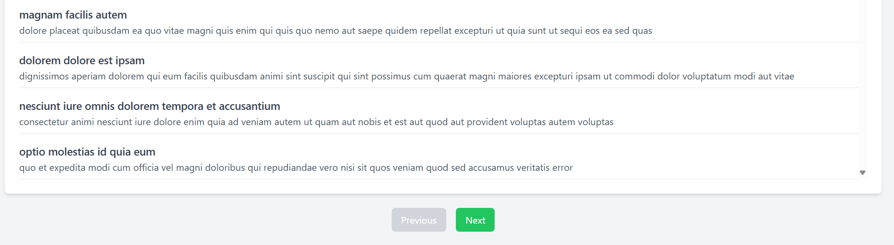

# User Dashboard

This is a React-based user dashboard application that fetches and displays user data from a REST API. The app includes a dashboard listing all users and allows navigation to detailed user profiles and activities. It is styled with Tailwind CSS and demonstrates modern React development practices.

---

## Features

- **Dashboard**: Displays a list of users fetched from a REST API.
- **User Profile**: Shows detailed information about a selected user.
- **User Activities**: Displays a list of posts created by the selected user.
- **Navigation**: Includes "Next" and "Previous" buttons to navigate between user details.
- **Responsive Design**: Styled with Tailwind CSS for a mobile-friendly layout.
- **Error Handling and Loading States**: Provides visual feedback during data fetching.

---

## Tech Stack

- **React**: For building the user interface.
- **TypeScript**: To add static type checking and improve code maintainability.
- **React Router**: For dynamic routing between dashboard and user details.
- **Axios**: To fetch data from REST API endpoints.
- **Tailwind CSS**: For modern, utility-first styling.

---

## API Endpoints

The app uses the following mock REST API endpoints:

1. **Users**: [https://jsonplaceholder.typicode.com/users](https://jsonplaceholder.typicode.com/users)
2. **Posts**: [https://jsonplaceholder.typicode.com/posts](https://jsonplaceholder.typicode.com/posts)

---

## Installation

1. Clone the repository:
   ```bash
   git clone https://github.com/your-username/user-dashboard.git
   cd user-dashboard
   ```

2. Install dependencies:
   ```bash
   npm install
   ```

3. Start the development server:
   ```bash
   npm start
   ```

4. Open your browser and navigate to:
   ```
   http://localhost:3000
   ```

---

## Usage

1. **Dashboard**: The default view lists all users. Click "View Details" to see a user's profile and activities.
2. **User Details**: Navigate between users using "Next" and "Previous" buttons. Return to the dashboard with the "Back to Dashboard" button.

---

## Screenshots

### Dashboard
)

### User Details
()
()

---

## Customization

1. **API Endpoints**: You can change the API endpoints in the `axios` calls inside `Dashboard.tsx`, `UserProfile.tsx`, and `UserActivities.tsx`.
2. **Styling**: Modify the Tailwind classes in the components to customize the design.
3. **Components**: Add new components or extend existing ones as per your requirements.

---

## Contributing

1. Fork the repository:
   ```bash
   git fork https://github.com/your-username/user-dashboard.git
   ```
2. Create a new feature branch:
   ```bash
   git checkout -b feature-name
   ```
3. Commit your changes:
   ```bash
   git commit -m "Add your message here"
   ```
4. Push to the branch:
   ```bash
   git push origin feature-name
   ```
5. Create a pull request on GitHub.

